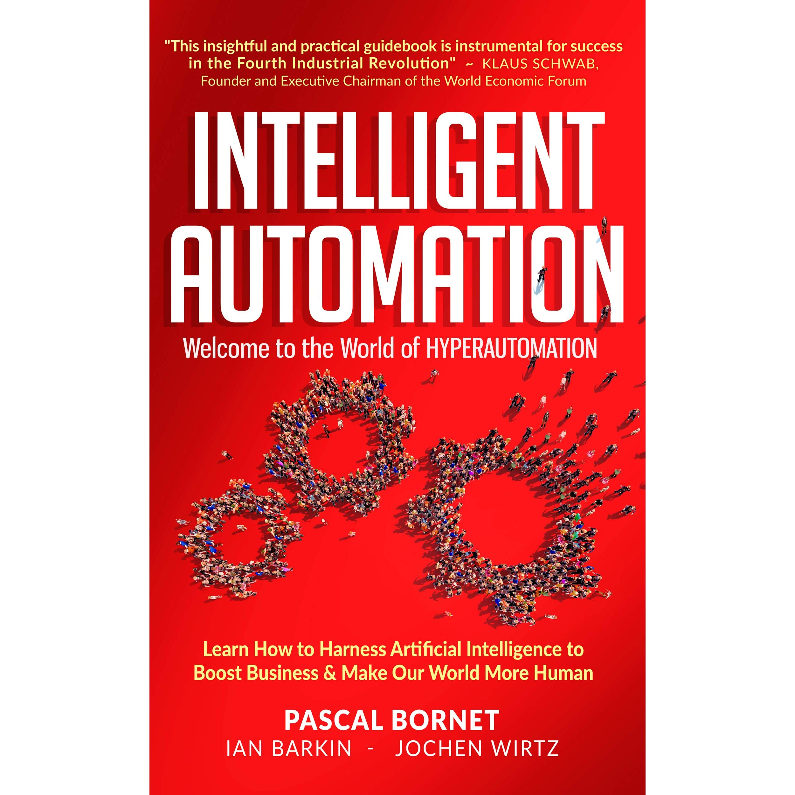

# Uncertainty in Deep Learning
**25-12-2020**

<a href="uncertainty-blog.md/">Uncertainty in Deep Learning: enter reverend Bayes</a>

# Intelligent Automation
**14-12-2020**

> "swapping two vowels has never been as impactful" - Jordy

Idea for reviewing Intelligent Automation

### 1. General impressions

### 2. Chapter by chapter

### 3. Review by hats
#### 3.1 AI researcher 

#### 3.2 AI project lead/manager

#### 3.3 AI engineer

#### 3.4 Looking for IA, e.g. innovation manager

### 4. Reading guide 

My two cents

Not sure if we should promote Mark Twain in these recent times, but still he shares one outright idea with Intelligent Automation: 

“It ain’t what you don’t know that gets you into trouble. It’s what you know for sure that just ain’t so.” – Mark Twain
Mistakes during automation! 
False positives are the true enemy

testing latex

\\[ a^2 = b^2 + c^2 \\]
