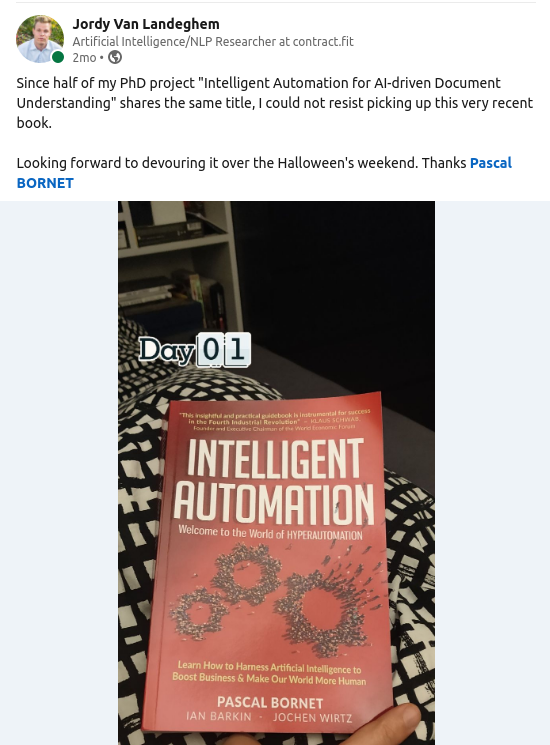
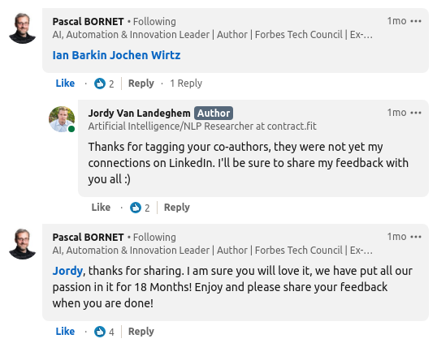
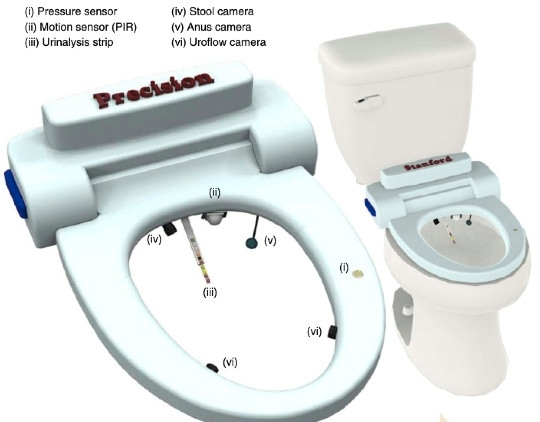

<!---

-->

Intelligent Automation
======================

**31-12-2020**

[Alternate reading view](https://sway.office.com/LpqRP7HcqzmraDfi?ref=Link) (mobile friendly)

Holding a promise
-----------------

Two months ago I posted the [following
message](https://www.linkedin.com/posts/jordy-van-landeghem-3b1166b3_since-half-of-my-phd-project-intelligent-activity-6727681423198818304-_cVI)
on LinkedIn:

To my surprise, the original authors responded and this post got around
10K views.

 

Now two months later, I have finally
finished reading this book, with interleaved reading & writing of plenty
academic research papers, which explains my tardiness.\
\
With this blogpost, I will hold my promise to share feedback on
**Intelligent Automation**.\
One warning beforehand, this is my first (voluntary) non-fiction book
review, so its quality might not do full justice to the reviewed book.
The book did a marvelous attempt at structuring and mapping out
higher-level trends in the Intelligent Automation landscape, with my
book review I will try to approximate the same rigor.

This review is organized as follows: First, I will give a more objective
summary of the book, introducing key concepts. Next, I present an
overview of each of the 4 book chapters, structured in the format of
*summary/takeaways-comments*. Finally, I will close the discussion with
how I would advise to read this book, and who (in terms of job roles)
would benefit most from reading it.

What makes automation intelligent? 
-----------------------------------

Pascal Bornet, Ian Barkin and Jochen Wirtz have compiled a first
reference book on Intelligent Automation (IA), alternatively
hyperautomation, a term coined recently in 2017.

While having a lot in common with its vowel-swapped cousin **Artificial
Intelligence** (AI), the authors clearly and necessarily differentiate
between the two.

**Intelligent Automation** comprises a compelling class of technologies
jointly capable of solving major world problems, <ins>when combined with
people & organizations</ins>:

-   A subset of AI for automation of knowledge work

-   Robotic Process Automatic (RPA): the macro on steroids

-   Workflow & Business Process Management (BPM)

-   \+ people & organizations

IA allows for the creation of a software-based **digital workforce**, by
mimicking four main human capabilities required to perform **knowledge
work**:

1.  **V**ision

2.  **L**anguage

3.  **T**hinking **&** **L**earning

4.  **E**xecution

Companies and workers can seriously benefit from implementing IA to
build **straight-through**, requiring no manual intervention, business
processes, which are more efficient (productivity, processing speed,
cost) and often more effective (quality and logic).\
Of course, depending on the complexity of the knowledge workers' task to
be automated, not all capabilities or technologies are always required.
Alternatively, some tasks *(the remaining 20%)* might not lend
themselves to automation at all, which is a nice thing, since IA only
aims at **taking the robot out of the human**, not replacing human
workers altogether.

Chapter by chapter
------------------

For each chapter in the book, I give an overview in the structure of
*summary/takeaways -comments.*

### Part 1: The promise of IA for a better world

IA cuts across many domains with foremost healthcare, education and
business. Globally, more than 80% of the workforce are knowledge
workers, which means the majority of humans can benefit from the support
of IA. Certainly if we consider that most office workers are still
working with "ancient tooling", whose limitations are made more apparent
with the recent COVID-19 crisis urging necessary digital
transformations.

This chapter really convinced me of the value of this book, there are a
plethora of references and statistics which have been meticulously
collected.

### Part 2: IA technologies explained

As explained before, IA comprises four key technologies and
capabilities, for which this chapter gives detailed examples.
Importantly, Natural Language Processing (NLP) is foundational to IA
systems as more and more unstructured data is being created with
organizations in dire need of structuring their data. While considering
to automate complex end-to-end processes, it warrants the effort to
build an IA roadmap where one prioritizes which capabilities should be
implemented based on business needs.

This chapter was less interesting to me as an AI researcher, since there
was not a lot of new material. Generally, it stays at an anecdotally
high level, most probably by necessity, since each of these capabilities
could have a whole book dedicated to them.

### Part 3: How organizations succeed in implementing IA

Success at scaling IA transformations is not a given. The implementation
of IA can fail due to gaps in *management vision and support*, improper
*change management*, underutilized or unreliable *data* assets,
*technical limitations**, ***high *cost* at *possibly low efficiency*,
*talent scarcity*, and *transformation complexity.*\
Then how can one succeed in IA transformations? Essentially, managing
each of the above challenges, incorporated into a IA transformation
roadmap, with appropriate prioritization & identification of IA
potential, project preparation, and an ongoing effort of change & talent
management will guide the way. The authors then take a more futuristic
perspective as to how IA transformation roadmaps could look like in the
future and what four levers will enable organisations to leverage more
IA successfully.

This chapter presents the bulk of the book (90 pages vs. +- 60 per
chapter) and distils the authors' experience and expertise wonderfully.
The first subchapters are introduced into a nice challenges--solutions
format. In my view, these were more targeted towards project/innovation
managers seeking to leverage IA within a larger company. I very much
liked some initial quotes that "*IA is a journey, not a project*", and
that "*IA is like medication to be administered to (sick) companies in
small targeted doses".*

As an AI researcher I was most looking forward to the discussion on
*technical limitations*, since removing these is supposedly my bread and
butter. It was short, but to the point in that current IA/AI solutions
are data-hungry and don't do well in scenario's they have not been given
previous explicit supervision for. Further, they point to a symbiosis
between humans and machines for handling technical limitations, in that
machines can handle the regular bulk and pass on edge cases to humans
for review. This **co-bot** perspective is something I very much believe
in. However, this will require an advancement of AI technology to make
their uncertainty or confidence assessment more reliable, which is
exactly the scope of my PhD project.

### Part 4: Reinventing society with IA

Success in IA should be focused on people, since they are at the heart
of any successful IA transformation. IA is mostly thought of in a
business context, but it can impact people's lives positively and
negatively. The authors argue for 5 imperatives that any company seeking
to leverage IA should respect. Thinking ahead both optimistically and
pessimistically, the authors present the future of work in a roadmap for
our society. The first 2 imperatives, *evolving skills* (adapting
education, redesigning job roles), and *sharing wealth* (Universal Basic
Income for countering wage inequality) are required in an optimistic
scenario. The last 3 imperatives *rethinking work* ("much of today's
work sucks"), *reinventing education* (education should aim to help
people find their purpose in life, less of a work-obsessed culture
stifling creativity), and *building a new society* (making governments
plan for changes that IA will inevitably bring).

This chapter is splendid in that it balances both the positive and
negative perspective on increasing automation. What we often might
forget while working with technology is that it's all for and about
people. This chapter reminds us that IA transformations should be
people-centric, with mindfulness about how it will affect the future of
work. What I am very happy about is that the book ends with this hopeful
note, instead of lingering too much on the dangerous side of AI and IA,
which too often gets picked up in the ../assets/IAblog. It nicely wraps up the
promise of IA that was started in Part 1 with a look towards the future.

### Bonus: IA use cases library 

This final book section provides a treasure trove of new and budding
ideas for automation in different functions of <ins>business</ins>:
finance, procurement, HR, legal, marketing, sales, ...; and
<ins>industry</ins>: medical and life sciences, banking, government
sector, telecommunications, insurance, .... For each use case, it
explains the end-to-end process and which capabilities (from Part 2) are
required to actionably automate it.

For example in business, (1) **process accounts payable** is a most
interesting finance use-case, requiring all 4 capabilities (V, L, T&L,
E). Particularly, the processing of vendor invoices or receipts into
accounting systems might involve OCR on scanned documents (V), which in
turn needs to be interpreted by NLP algorithms to extract essential
entities for payment (total amount, IBAN, invoice date, invoice number,
VAT details, ...) and detail item lines (L). When not all information is
present, the solution could query external databases to fill in
remaining gaps or enrich extracted information (T&L). In this complete
end-to-end process, exceptions need to be identified and routed towards
human workflows for processing and approval (E).

For example in industry, (2) **smart toilets** [1] can help with daily
health monitoring and even real-time drug dispensing (V, T&L, E). The
below prototype by Stanford University medical school can give you an
idea 😉

\
[1] Park, Seung-min, et al. \"A mountable toilet system for personalized
health monitoring via the analysis of excreta.\" Nature Biomedical
Engineering 4.6 (2020): 624-635.

Closing remarks
---------------

### Reading guide

INTELLIGENT AUTOMATION: *Learn how to harness Artificial Intelligence to
boost business and make our world more human*

The book has a really well-sculpted structure and reads like a
train! What I did notice during my reading is that it's best to read
each chapter in its entirety, since picking up where you left off might
be hard to orient yourself again. One exception is chapter 3, which has
a deeper nested structure where it is easy to loose the thread. To
ensure you really grasp the knowledge from that chapter, I would advise
to read the first two subchapters (pages 162-199) on challenges and
success factors for IA transformations. Then let this sink in, before
continuing (pages 200-251) on which factors will enable IA success in
the future. While I understand they are grouped together, the latter
could have been distilled in a separate chapter.

### My views on Intelligent Automation after reading

To me, this reference book on IA provides a necessary answer to my
personal question: **Why are we pursuing advances in AI and when are we
successfully advancing towards IA?**

While the answer lies in a symbiosis of technologies, it is nonetheless
a welcome reminder of what could be achievable *ex vitro* -- out of the
lab environment \--.

From a business perspective, it is insightful to see how to move towards
increasingly more advanced "self-driving enterprises". While at the same
time, we need to be mindful of the impact that automation brings and
prepare for it accordingly.

For fellow AI researchers working on language/vision, this book is a
must-read. It reminds ourselves there are challenges beyond
incrementally pushing state-of-the-art on an academic benchmark --MNIST
anyone?\--. We cannot solely rely on industry to find solutions to
applied AI, and in consequence IA challenges, since in fact those
challenges are what stand in the way of the true value the technology
can bring.

While we are still working away technical limitations of AI technology,
its potential value is almost limitless when embedding into the mindset
of IA. Algorithms should not be infallible, they should be reliable and
where uncertain the "better" human can take over. The true challenge for
embedding more advanced AI into IA then becomes keeping mistakes during
automation low, the so-called **false positives**, where the algorithm
is convinced it is right, yet in fact isn't. Or as Mark Twain puts it:

> "It ain't what you don't know that gets you into trouble. It's what
> you know for sure that just ain't so." -- Mark Twain

### What's next for this physical copy?

What might be nice, is that the physical book owner receives a
read-only, secure, non-distributable digital copy.😊 I and most probably
others would like to refer to some of the nice illustrations in this
book.

This physical book will find a new home in the
[Contract.fit](https://www.contract.fit) library, once we hopefully
return to our physical offices in Brussels. But before this, it will do
the tour in our company, next up our company's co-founders Pol
Brouckaert, and then Bertrand Anckaert!

# Uncertainty in Deep Learning
**2021**
[IN THE WORKS]
<a href="uncertainty-blog.html">Uncertainty in Deep Learning: enter reverend Bayes</a>

